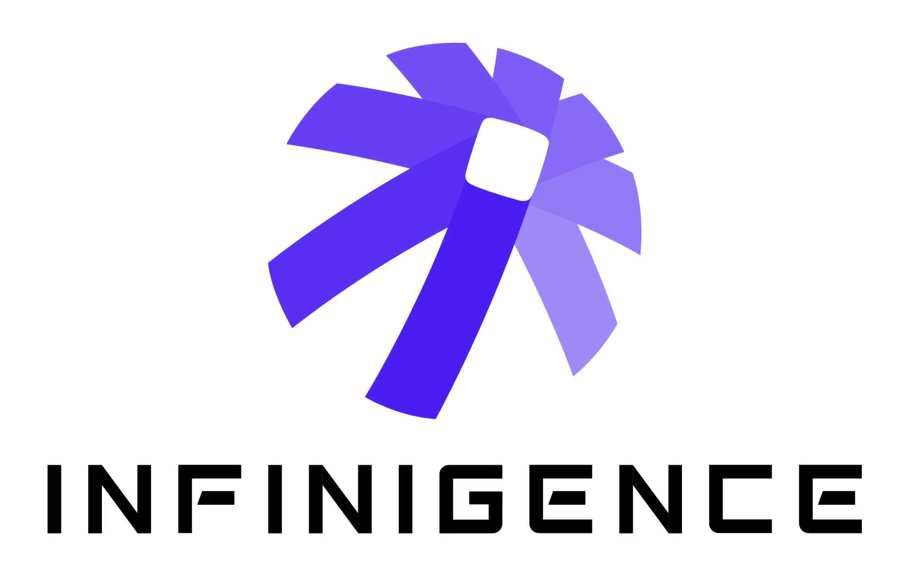

 **I am looking for a PhD position in 2026, and also open to seeking an online research assistant position at any time.** 

Hi, I am Yupu Yao, a sophomore student in the University of Electronic Science and Technology of China (UESTC). Thank you for visiting my homepage.

My research interest is machine learning.

Publications
======
●  <a href="https://yupuyao.github.io" style="color:black; font-weight:bold;">Y Yao</a>
, <a style="color:black; text-decoration:none;">B Yang</a>.
 **GeoPE: A Unified Geometric Positional Embedding for Structured Tensors.**  
In _preprint_, 2025.
 [[PDF]](https://arxiv.org/abs/2512.04963)

●  <a href="https://yupuyao.github.io" style="color:black; font-weight:bold;">Y Yao</a>.  
**Generalize Neural Network Through Smooth Hypothesis Function.**  
In _The Second Tiny Papers Track at ICLR_, 2024.  
[[PDF]](https://openreview.net/forum?id=RpiiKMGaK3)

●  <a href="https://yupuyao.github.io" style="color:black; font-weight:bold;">Y Yao</a>
, <a style="color:black; text-decoration:none;">S Deng</a>, <a style="color:black; text-decoration:none;">Z Cao</a>, <a href="https://harryzhangog.github.io" style="color:black;">H Zhang</a>, <a href="https://liangjiandeng.github.io" style="color:black;">LJ Deng</a>.
 **APLA: Additional Perturbation for Latent Noise with Adversarial Training Enables Consistency.**  
In _preprint_, 2023.  
[[PDF]](https://arxiv.org/abs/2308.12605)

Education
======

  

  

    
Sept. 2022 – : UESTC, Chengdu

    
Undergraduate Student

    
* University of Electronic Science and Technology of China

  

Work Experience
======

  

  

    
Aug. 2025 – : Infinigence AI, Shanghai

    
Software Engineer Intern 

  

Visitors
======
<html>
<body>

</body>
